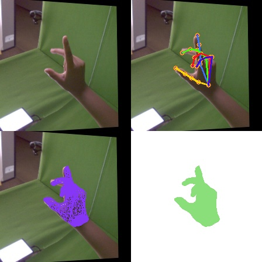
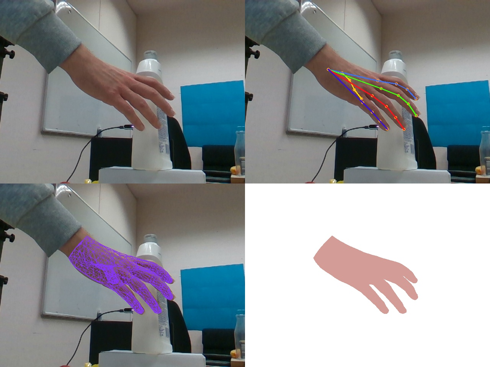
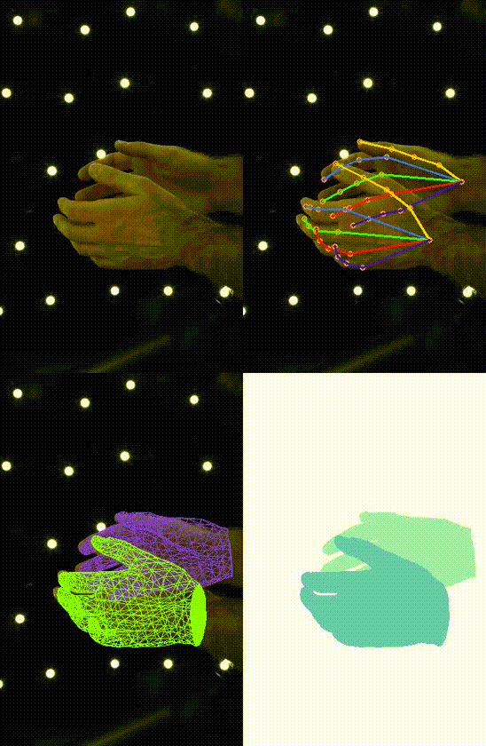

# handpose X plus

#### 该项目目的是为了构建低成本&高效率的三维手势交互产品，在智能眼镜等交互产品中广泛应用。

* handposeX json 格式 简称： “hpx json 格式”
* handposeX json 格式数据加入知识星球：DataBall - X 数据球(free)


| 开发计划        | 内容 | 数据量 |hpx格式样例-release | 状态 |
|-----------------|----------|-----------|------|-----------|
| 数据集整合 | handposeX_3D_rgb_v1 |  1k+  ||    持续增加中    |
| 数据集整合 | handpose X plus    | 1018 (商业数据30w+)|√ | √  |
| 数据集整合 | FreiHAND           | 32560   |√ | √        |
| 数据集整合 | HO3D_v3           |  75663  |√ |  √     |
| 数据集整合 | InterHand26M 5fps  |    | | 进行中     |
| 数据集整合 | TACO 工具协同 |    | | 进行中     |
| 基础 PipeLine  | 基础版本模型   |    ||    进行中     |


# 一、数据集整合

```bash
注意：
1)为了方便使用，按照 handposeX json 自定义格式存储。
2)使用常见依赖库进行调用,降低数据集使用难度。
3)部分数据集获取请加入：DataBall-X数据球(free)
4)完整数据集获取请加入：DataBall-X数据球(vip)
```
- [x] [handpose X plus]
- [x] [FreiHAND](https://github.com/XIAN-HHappy/handpose_x_plus/tree/main/script/FreiHAND)
- [ ] [handposeX_3D_rgb_v1]
- [x] [HO3D_v3]
- [ ] [InterHand26M]
- [ ] [TACO 工具协同]

## 1.1 handpose X plus 数据集
* 数据量：32560

* [handpose X plus - 演示完整视频](https://www.bilibili.com/video/BV1HTYReYEBj/?share_source=copy_web&vd_source=014da96a262b45c24251d22ed2727fba)  


```bash
数据内容包括：

* 1）rgb 图像 （rgb image）
* 2）深度点云图像 (depth image)
* 3）手21三维和二维关键点 (21 3d & 2d joints)
* 4）手三维和二维mesh网格点 (3d & 2d mesh )
* 5）相机内参 (camera Intrinsics : fx, fy, cx, cy)
* 6）静态手势 (gesture)
* 7）手部mask （hand mask）
* 8）室内&室外场景
```
```bash
数据集解析,脚本运行如下:
python read_datas.py
```

#### 数据增强样例


```bash
数据增强,脚本运行如下:
python read_datas_augmentation.py
```

```bash
官方项目：https://github.com/lmb-freiburg/freihand
```

## 1.2 FreiHAND 数据集

* 数据量：32560
* FreiHAND 采用handposeX json 格式，示例如下：
```bash
{
 "author": "XIAN",
 "img_name:": "",
 "cx": 112.0,
 "cy": 112.0,
 "fx": 388.9018310596544,
 "fy": 388.71231836584275,
 "hands": [
  {
   "label": "right",
   "joint3d": [
    [
     29.402047395706177,
     -27.920207008719444,
     587.0807766914368
    ],
    ······
   ],
   "vertex3d": [
    [
     10.056010007858276,
     29.915300235152245,
     -626.9440693855286
    ],
    ······
   ]
  }
 ]
}
```

#### 脚本运行
```
# 下载 handposeX json 格式数据集放在根目录
cd script/FreiHAND
python read_handposex_json.py
```
#### 示例


## 1.3 HO3D_v3 数据集
* 数据量 75663

```bash
官方项目地址：https://github.com/shreyashampali/ho3d
```
#### 脚本运行
```
# 下载 handposeX json 格式数据集放在根目录
cd script/HO3D_v3
python read_handposex_json_HO3D_v3.py
```
#### 示例


## 1.4 InterHand26M 数据集
* InterHand2.6M_5fps_batch1-20250302-min
* 更多数据集加入知识星球：“DataBall - X 数据球（vip）”
```bash
官方项目地址：https://mks0601.github.io/InterHand2.6M/
```
#### 脚本运行
```
# 下载 handposeX json 格式数据集放在根目录
cd script/InterHand26M
python read_InterHand26M.py
```
#### 示例


## 1.5 TACO 数据集
* 官方项目地址：https://github.com/leolyliu/TACO-Instructions
```bash
@inproceedings{liu2024taco,
  title={Taco: Benchmarking generalizable bimanual tool-action-object understanding},
  author={Liu, Yun and Yang, Haolin and Si, Xu and Liu, Ling and Li, Zipeng and Zhang, Yuxiang and Liu, Yebin and Yi, Li},
  booktitle={Proceedings of the IEEE/CVF Conference on Computer Vision and Pattern Recognition},
  pages={21740--21751},
  year={2024}
}
```

#### 脚本运行
```
# 下载 handposeX json 格式数据集放在根目录
cd script/TACO
python read_taco.py
```

#### 示例（第一人称视角）


-----------------------------------
#### 加入 “DataBall - X 数据球” 知识星球,获取数据集


### 即将发布 Coming Soon
### 联系方式 （Contact）  
* E-mails: 305141918@qq.com   


####  谢谢支持 a cup of coffee


